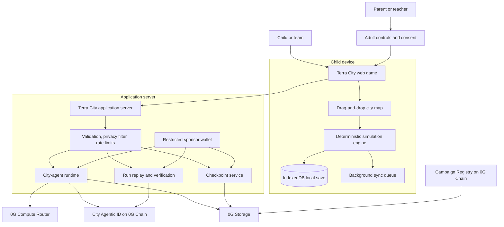

# Terra World Architecture

## Current direction — the Rivergate living-city pivot

The current product is the adult living-city game in [storyline.md](storyline.md),
with **Leo** as companion and **Malik** as the construction entrepreneur.
The authoritative target architecture, current-versus-planned inventory, real
0G Compute/Storage/Agentic NFT responsibilities and delivery gates are now in
[Living-city architecture](docs/living-city-architecture.md).

The material below is retained as the **legacy learning-MVP specification**.
It is not the current audience, opening, feature scope or a deployment record.
In particular, an empty starting map, child-facing framing, and the custom
TerraCityAgent contract must not be mistaken for the new populated adult city
or a verified ERC-7857 integration. Existing save, validation and security
protections remain in force unless an explicit versioned migration replaces them.

---

# Legacy learning-MVP specification

## 1. Product summary

Terra World is a browser-based learning game for children aged approximately 8–13. Children join the populated river-valley town of Rivergate and help it grow by moving and placing homes, utilities, public services, transport, waste systems, and natural infrastructure.

Rivergate is the persistent agentic entity. It remembers verified milestones and evolves over time. Leo is its bounded child-facing companion: he observes deterministic city outcomes, asks discovery questions, and explains consequences without changing the simulation.

The child never connects a wallet, approves a transaction, handles tokens, or sees blockchain terminology.

### MVP promise

> Join a living town, discover how its systems affect one another, shape its future, and help it survive the final storm.

### Learning method

Terra City does not teach through conventional quizzes. Its learning loop is:

1. Understand a city need.
2. Predict what might solve it.
3. Drag and place infrastructure.
4. Run the city simulation.
5. Observe visible consequences.
6. Hear Leo notice the change, ask a question, and explain only after observation.
7. Revise the design.

## 2. Architectural principles

1. **The simulation is authoritative.** AI explains outcomes but never calculates or changes them.
2. **The city is the agent.** Rivergate owns the Agentic ID; Leo is its bounded in-world interface, never a separate child identity or generic chatbot.
3. **0G is invisible to children.** The application sponsors all storage, compute, identity, and chain operations.
4. **Local-first interaction.** Dragging, placement, simulation, and ordinary saves work without waiting for a network transaction.
5. **Milestones, not clicks, go on-chain.** Only meaningful city evolution is committed to the Agentic ID.
6. **No child personal data on-chain.** City identity and city history are distinct from child identity.
7. **Graceful degradation.** The city remains playable when 0G services are temporarily unavailable.

## 3. High-level system



## 4. User experience architecture

### 4.1 Child experience

The child sees only game concepts:

- Create my city
- Choose a city name and emblem
- Select a planning role
- Drag a building onto the map
- Inspect water, power, nature, and community coverage
- Run the city
- Ask the city for an explanation or hint
- Improve the design

The child never sees:

- Connect wallet
- Gas fees
- Token balances
- Transaction signatures
- Contract addresses
- Storage hashes
- Model-provider selection

### 4.2 Adult experience

An adult area is separated from child play. It controls:

- Optional cloud backup
- Family or classroom membership
- Learning summaries
- AI and privacy information
- Data deletion
- Optional future ownership of the city's Agentic ID
- Technical proof mode for hackathon judges

### 4.3 Identity layers

| Layer | Child-facing representation | Technical representation |
|---|---|---|
| Player | Avatar, nickname, selected role | Local profile or adult-managed member ID |
| City | Name, emblem, stage, traits | Agentic ID token and city ID |
| Adult | Parent or teacher sign-in | Adult account and optional owner address |
| Platform | Invisible | Sponsor wallet and authorised executor |

For the MVP, the platform sponsor owns newly created City Agentic IDs. A later adult-only flow may transfer a city to a parent or teacher.

## 5. Gameplay architecture

### 5.1 Map

The MVP uses one isometric or top-down river-valley map divided into placeable tiles.

Each tile contains:

- Terrain type
- Elevation band
- Flood risk
- Soil or habitat value
- Existing occupancy
- Road, water, and electricity connections

### 5.2 Draggable building catalogue

The MVP contains approximately twelve placeable items:

1. Home
2. Road
3. Water pump
4. Water-treatment plant
5. Solar array
6. Battery
7. School
8. Clinic
9. Bus stop
10. Recycling centre
11. Wetland
12. Trees or community park

Each building definition is data-driven:

```ts
type BuildingDefinition = {
  id: string;
  name: string;
  category: "housing" | "water" | "energy" | "service" | "transport" | "waste" | "nature";
  constructionCost: number;
  maintenanceCost: number;
  footprint: TileOffset[];
  placementRules: PlacementRule[];
  inputs: ResourceFlow[];
  outputs: ResourceFlow[];
  effects: CityEffect[];
  coverage?: CoverageDefinition;
};
```

### 5.3 Placement interaction

While dragging a building, the game displays:

- Green valid tiles
- Red invalid tiles
- Flood-risk overlay
- Water and electricity coverage
- Habitat impact
- Construction cost
- Maintenance cost
- Connection requirements

Placement is provisional until the child selects **Run the City**. Provisional changes can be undone freely.

### 5.4 Guided campaign

A completely unrestricted sandbox may overwhelm first-time players. The MVP begins with an empty map but introduces systems through five guided chapters:

1. **Water brings a town to life** — water source, pipes, and first homes.
2. **Power the neighbourhood** — solar generation, batteries, and reliability.
3. **Care for residents** — clinic, school, safety, and fair access.
4. **Handle growth** — waste, transport, pollution, and maintenance.
5. **Survive the storm** — flooding, backup power, wetlands, and resilience.

The sandbox opens progressively as the child learns each system.

### 5.5 Neighbourhood Adventure Trail

The child-facing MVP exposes the same learning arc as fifteen compact map
challenges grouped into five stages of three:

1. **Home Helpers** — notice one problem and make one direct repair.
2. **Street Team** — recognise and solve the same need across several homes.
3. **Eco Planners** — combine power, water, nature, and waste decisions.
4. **Weather Watchers** — restore homes after drought, blackout, and rain.
5. **City Guardians** — sequence repairs and recover the whole neighbourhood.

Each challenge owns a deterministic starting town, one to three verifiable
goals, an authored three-step hint ladder, a target move count, and a learning
statement. Completion never fails because of move count or hint use; those
values affect only an encouraging one-to-three leaf result. Unlocks are strictly
sequential, replays are allowed, and progress is stored locally without identity,
account, or wallet data.

## 6. Deterministic simulation engine

The simulation engine is a pure TypeScript package shared between the browser and server.

### 6.1 Responsibilities

- Validate building placement
- Calculate construction and maintenance costs
- Calculate water, electricity, waste, transport, and service coverage
- Advance population and city demand
- Apply pollution and biodiversity effects
- Run scheduled events and the final storm
- Produce structured causes and effects
- Generate reproducible state hashes
- Replay a complete run on the server

### 6.2 Main state

```ts
type CityState = {
  schemaVersion: 1;
  cityId: string;
  campaignId: string;
  campaignVersion: number;
  seed: string;
  turn: number;
  stage: "seed" | "settlement" | "town" | "city" | "resilient-city";
  population: number;
  budget: number;
  tiles: TileState[];
  buildings: PlacedBuilding[];
  indicators: {
    water: number;
    energy: number;
    nature: number;
    community: number;
    resilience: number;
  };
  resources: ResourceState;
  milestones: string[];
  actionLog: TurnAction[];
};
```

### 6.3 Turn execution

```text
Provisional placements
        ↓
Validate prerequisites and available budget
        ↓
Commit accepted placements
        ↓
Rebuild utility and transport networks
        ↓
Calculate production, demand, coverage, and maintenance
        ↓
Apply environmental and community effects
        ↓
Process scheduled event
        ↓
Update population, indicators, stage, and milestones
        ↓
Return CityState + structured CauseEffect[]
```

### 6.4 Determinism

Given the same:

- Campaign version
- Initial seed
- Ordered action log

the engine must always produce the same final state and state hash. Random events use the fixed scenario seed rather than uncontrolled randomness.

## 7. City Agentic ID

### 7.1 Concept

Every team builds its own living city. The city—not the child and not a generic assistant—is represented by an Agentic ID.

The Agentic ID gives the city:

- Persistent identity
- Declared capabilities
- Encrypted evolving intelligence
- Verifiable ownership and authorised usage
- A history of resilience milestones
- Optional interoperability through ERC-8004 later

### 7.2 Public identity metadata

- City ID and Agentic ID token ID
- City name and emblem reference
- Campaign and ruleset version
- Current development stage
- Declared agent capabilities
- Current encrypted-intelligence commitment
- Anonymous resilience traits

### 7.3 Encrypted intelligence metadata

Stored as ciphertext on 0G Storage:

```ts
type CityIntelligence = {
  schemaVersion: 1;
  cityId: string;
  personality: CityPersonality;
  speakingPolicy: SpeakingPolicy;
  curriculumFactsVersion: string;
  currentMission: MissionContext;
  memories: CityMemory[];
  checkpointRoot: string;
  safetyPolicyVersion: string;
  updatedAt: string;
};
```

City memories describe verified city events, never the child's personal identity:

```text
Allowed: "A battery stabilised the clinic on turn four."
Allowed: "Wetlands reduced downstream flood damage."
Forbidden: child name, age, school, location, chat transcript, or inferred profile.
```

### 7.4 Capabilities

The city agent may:

- Read structured city state
- Explain verified consequences
- Ask reflective questions
- Offer graduated hints
- Select from approved missions
- Refer to verified city memories
- Update encrypted memory after milestones
- Record anonymous resilience traits

The city agent may not:

- Directly change city state or scores
- Invent buildings, prices, or rules
- Spend or transfer tokens
- Transfer its own Agentic ID
- Store unrestricted child conversation
- Contact other players
- Publish detailed play histories

### 7.5 Lifecycle

```text
Create city
    ↓
Mint Agentic ID through sponsor wallet
    ↓
Encrypt starting intelligence
    ↓
Upload ciphertext to 0G Storage
    ↓
Set Agentic ID intelligence URI and commitment
    ↓
Play locally
    ↓
At verified milestone: create new city memory
    ↓
Encrypt and upload new intelligence version
    ↓
Update Agentic ID commitment
```

Only milestone transitions update the Agentic ID. Ordinary drag-and-drop actions do not create transactions.

## 8. 0G Compute

0G Compute provides the intelligence used to express the city's voice. The application uses the 0G Compute Router from the server so API keys and billing remain invisible to the child.

### 8.1 Supported tasks

1. Explain a deterministic outcome in age-appropriate language.
2. Ask one reflective question.
3. Produce a three-level hint ladder.
4. Generate a short in-character city reaction.
5. Summarise a verified chapter milestone into a structured city memory.

### 8.2 Input contract

The application sends structured facts rather than unrestricted conversation history:

```ts
type CityGuideRequest = {
  ageBand: "8-10" | "11-13";
  task: "explain" | "hint" | "react" | "memory";
  cityPersonality: SafePersonalityView;
  mission: SafeMissionView;
  before: IndicatorSnapshot;
  action: SafeActionSummary;
  after: IndicatorSnapshot;
  causes: CauseEffect[];
  allowedFacts: string[];
  relevantMemories: CityMemory[];
};
```

### 8.3 Output contract

```ts
type CityGuideResponse = {
  headline: string;
  message: string;
  reflectiveQuestion?: string;
  hints?: [string, string, string];
  vocabulary?: { term: string; meaning: string }[];
  memoryCandidate?: CityMemory;
};
```

All responses are parsed from strict JSON, schema-validated, age-length-limited,
checked against the requested task shape, and restricted to facts, buildings,
metrics, messages, causes, and numbers present in the verified request. Unsafe,
malformed, overlong, or ungrounded provider output is discarded without being
returned to the child; a separately validated campaign-authored fallback is used
instead.

### 8.4 Privacy mode and fallback

- Use the Router's private trust mode where available.
- Never send child personal data.
- Never expose the Compute API key in the browser.
- If private inference is unavailable, display a prewritten explanation from the campaign pack.
- Never silently downgrade privacy to obtain an answer.
- Do not block simulation or saving on an inference failure.

The guide orchestrator accepts only responses explicitly marked as private,
enforces a bounded timeout, and validates authored fallback content through the
same output boundary. Its bounded TTL/LRU cache stores only generic
explanations with no city-state grounding, digits, memories, or adaptive task
content. Persistent keys contain only age band, task, verified cause codes, and
fact keys; exact-request coalescing uses a separate ephemeral key so two city
snapshots cannot share an in-flight response.

Provider requests are created only from the minimized `CityGuideRequest`.
Rivergate's system task contract requires strict JSON, first-person city voice,
verified grounding, and task-specific shapes for explanations, reactions,
three-step hints, reflective questions, and structured memory candidates. The
request has no free-form child text, and user-supplied values are explicitly
treated as inert data rather than instructions.

`POST /api/guide` and the narrower `POST /api/challenges/hint` are the
browser-facing Compute boundaries. Both validate bounded JSON before provider
use, construct prompts server-side, require private and TEE-verified provider
metadata, and cap and validate extracted assistant content. The challenge route
accepts only a known challenge ID, known completed goal IDs, and a bounded move
count—never free-form child text. Configuration, network, quota, timeout,
privacy, rate-limit, malformed-output, and unsafe-output failures return only
validated authored fallback content. Responses are `private, no-store`, and the
anonymous fixed-window limiters keep no IP, account, wallet, or child identifier.

## 9. 0G Storage

### 9.1 Public campaign packs

Each campaign is a versioned content bundle:

```text
campaigns/rivergate-v1/
  manifest.json
  map.json
  chapters.json
  missions.json
  buildings.json
  ruleset.json
  learning-objectives.json
  guide-facts.json
  locales/en.json
  assets/...
```

The published 0G Storage root and ruleset hash are registered on 0G Chain. Downloads use proof verification and are cached locally for offline play.

The local Rivergate v1 build assembles this content from the same typed campaign, map, catalogue, evaluator, learning-fact, and localisation sources used by the simulation. Its canonical package trust anchor is `0ca0cf041460eb3c`. This local deterministic hash detects accidental or forged package changes before publication; the cryptographic 0G Storage root remains the network proof after upload.

The server-side Storage adapter uses the adult sponsor signer and the official
0G TypeScript SDK. It computes the Merkle tree before upload, accepts only one
root/transaction response, and requires proof-enabled retrieval. The downloaded
root, SHA-256 content hash, and Rivergate package trust anchor must all agree
before bytes are accepted. Campaign JSON must use canonical encoding; encrypted
checkpoint envelopes remain opaque ciphertext. The child-facing browser never
receives the sponsor key or signs a Storage transaction.

### 9.2 Encrypted city checkpoints

At the end of a chapter or milestone:

1. Serialize the verified `CityState` and action log.
2. Encrypt the checkpoint in the browser using AES-GCM.
3. Upload only ciphertext to 0G Storage.
4. Store the returned root in the adult-controlled session and the encrypted Agentic ID metadata.

Local saves occur immediately. Cloud backup runs asynchronously.

Checkpoint ciphertext uses a versioned AES-256-GCM envelope with a fresh 96-bit IV. City ID, campaign/version, checkpoint schema version, creation time, key ID, algorithm, and envelope version are authenticated as additional data. Keys are non-extractable in normal browser use; wrong keys, modified ciphertext, modified IVs, altered metadata, and unsupported versions fail before any restored state is accepted.

The local-first backup coordinator derives a deterministic SHA-256 idempotency
key from canonical ciphertext, returns after the local write, and processes
remote uploads through leased `pending`, `uploading`, `retry-wait`, `synced`,
and `failed` states. Only retryable failures are retried, and stale workers
cannot overwrite a newer successful attempt. Adult-controlled restore
references must match the remote root, content hash, byte length, key ID, and
authenticated campaign/city metadata before decryption or local acceptance.

The browser persists this encrypted queue in a versioned IndexedDB store.
Save-if-absent, upload claims, and claim settlement are atomic across tabs;
expired leases can be reclaimed without allowing stale workers to overwrite a
newer result. Records are strict-schema validated on every read and write.
Malformed or secret-bearing entries are removed with sanitized notices, and an
isolated in-memory fallback keeps server rendering or storage-denied browsers
playable.

The server-side checkpoint bridge accepts only encrypted-envelope bytes from
the queue and delegates signing to the adult-sponsored 0G Storage adapter. It
binds the deterministic idempotency key to the ciphertext hash, validates the
upload receipt, requests proof-verified retrieval with the expected root and
content hash, and independently rechecks downloaded hash and length. Unknown or
integrity failures fail closed; only typed retryable Storage failures re-enter
the bounded queue. The browser route now uses a short-lived, HttpOnly,
same-origin adult session; the adult panel can create and test-restore an
encrypted recovery point without exposing a wallet or sponsor credential. A
real 0G Storage rehearsal still requires deployment credentials and funding.

## 10. 0G Chain contracts

### 10.1 `TerraCampaignRegistry`

Registers official campaign content:

```solidity
function registerCampaign(
    bytes32 campaignId,
    uint32 version,
    bytes32 storageRoot,
    bytes32 rulesetHash
) external onlyPublisher;
```

### 10.2 `TerraCityAgent`

An ERC-7857-style Agentic ID contract for city identity and encrypted intelligence.

Required operations:

- Mint a city Agentic ID
- Read owner and authorised executor
- Read encrypted metadata URI and commitment
- Authorise restricted application usage
- Update encrypted intelligence after a verified milestone
- Record anonymous resilience milestones
- Pause transfers for the MVP

### 10.3 Completion commitment

```solidity
function recordMilestone(
    uint256 cityTokenId,
    bytes32 milestoneId,
    bytes32 runCommitment,
    bytes32 intelligenceHash
) external onlyAuthorizedExecutor;
```

`runCommitment` is a salted hash of:

- Final state hash
- Action-log hash
- Campaign root
- City Agentic ID
- Random nonce

It never includes child identity or the raw action history.

### 10.4 Sponsorship

A restricted server wallet sponsors contract and storage transactions. It must have:

- Environment-managed keys
- Per-operation allowlists
- Daily spending limits
- Rate limits per city session
- Monitoring and emergency pause capability

## 11. Application server

The MVP can use Next.js Route Handlers or an equivalent small TypeScript service.

### API surface

```text
POST /api/cities
  Create a city session and sponsor Agentic ID minting

GET /api/cities/:cityId
  Resolve public identity and latest permitted checkpoint

GET /api/campaigns/:campaignId
  Resolve official root and return a verified campaign manifest

POST /api/guide
  Run an authorised, constrained 0G Compute task

POST /api/checkpoints
  Upload ciphertext and attach its root to the adult-controlled session

POST /api/runs/:cityId/verify
  Replay the action log and return a verified final state

POST /api/runs/:cityId/milestone
  Verify, update encrypted city intelligence, and record a milestone
```

### Server boundaries

- Treat all browser input as untrusted.
- Validate campaign, building, and action IDs against the registered ruleset.
- Re-run milestone simulations on the server.
- Keep sponsor-wallet and Compute credentials server-only.
- Never accept arbitrary prompts for Agentic ID memory updates.
- Store application session records separately from public chain data.

## 12. Local persistence and synchronisation

### IndexedDB stores

```text
profiles          Child-facing local avatar and preferences
cities            Current local CityState
campaign-cache    Verified campaign packs
campaign-sessions Atomic, versioned gameplay resume state (campaign, history, ending, and provisional plan)
action-logs       Ordered deterministic actions
sync-queue        Pending checkpoints and milestones
settings          Accessibility and device preferences
```

### Sync strategy

- Save the local campaign session after every committed or provisional change.
- Replay and verify the ordered action log before accepting a restored session.
- Upload checkpoints only at chapter boundaries.
- Update Agentic ID only for verified milestones.
- Use idempotency keys for retryable server requests.
- Resume pending sync when connectivity returns.
- Show “Saved on this device” and “Backed up” as separate adult-facing states.

## 13. Safety and privacy

### Never collect or publish

- Child legal name
- Birth date
- Precise age
- School or classroom name in public metadata
- Location
- Free-text conversation history
- Behavioural or psychological profile
- Public child username

### Child AI interaction

The MVP uses bounded actions rather than unrestricted chat:

Guide telemetry is content-free by construction. Its strict event schema can
record only bounded task, age-band, source, outcome, failure-class, and duration
bucket enums. Request content, response content, child identity, raw errors,
wallet data, and exact timings have no representable fields; validation or
logging failure never interrupts gameplay.

- Explain what happened
- Give me a small hint
- What needs help?
- What did we learn?
- Read this aloud

The onboarding explains:

> Rivergate is a computer character. It remembers what happens in your city, but you should never share private information with it.

### Adult consent

- Local guest play works without account creation.
- Cloud backup and persistent Agentic ID memory require the adult-controlled flow.
- Adults can delete the application session and request removal of encrypted off-chain data where supported.
- On-chain commitments contain no personal information and cannot reveal checkpoint contents.

## 14. Failure behaviour

| Failure | Child experience | Recovery |
|---|---|---|
| 0G Compute unavailable | Prewritten city explanation | Retry future guide requests |
| 0G Storage upload fails | “Saved on this device” | Background sync queue |
| Chain update delayed | Milestone celebration continues | Idempotent retry |
| Campaign proof invalid | Campaign does not load | Use last verified cached version |
| Server unavailable | Local gameplay continues | Reconnect and synchronise |
| Invalid AI response | Safe prewritten response | Log validation failure without child data |

## 15. Proof mode

The normal child interface hides technical infrastructure. An adult/judge-only proof drawer exposes:

- City Agentic ID and current intelligence commitment
- Declared and authorised capabilities
- Campaign version and 0G Storage root
- Ruleset hash
- 0G Compute trust tier and verification status
- Latest anonymous milestone transaction
- Server replay status and final state hash

This allows judges to verify deep 0G integration without compromising the child experience.

## 16. Recommended repository structure

```text
terra-world/
  architecture.md
  apps/
    web/
      app/                         Next.js pages and API routes
      components/                  Shared interface components
      game/                        Babylon.js town/interior scenes and React game controls
      lib/immersive-town/          3D environment, civic scenery, traffic, upgrades, cameras, and room diagnostics
      features/city-builder/       Drag, placement, overlays, catalogue
      features/city-guide/         City dialogue and hint interface
      features/adult-controls/     Consent, reports, and proof mode
      lib/offline/                 IndexedDB and synchronisation
      lib/checkpoints/             AES-GCM envelopes, durable queue, and restore verification
  packages/
    simulation/
      src/state.ts                 CityState schemas
      src/engine.ts                Deterministic turn execution
      src/placement.ts             Tile and building validation
      src/networks.ts              Utilities and transport graphs
      src/events.ts                Seeded events and final storm
      src/replay.ts                Server verification
      test/                        Golden scenario tests
    campaign-schema/
      src/                         Campaign validation and types
    zero-g/
      src/network.ts               Public testnet/mainnet boundaries
      src/server/config.ts         Server-only credentials and policy
      src/server/compute.ts        Private 0G Compute Router adapter
      src/server/storage.ts        Upload, download, and proof checks
      src/agentic-id.ts            City identity and memory updates
      src/chain.ts                 Campaign and milestone operations
    safety/
      src/city-guide.ts            Input minimisation and request schema
      src/prohibited-data.ts       Child-data boundary scanner
      src/guide-output.ts          Output validation
      src/guide-prompt.ts          Rivergate task construction
      src/telemetry.ts             Content-free operational logging policy
      src/memory.ts                Structured memory policy
  contracts/
    src/TerraCampaignRegistry.sol
    src/TerraCityAgent.sol
    test/
  campaigns/
    rivergate-v1/
  scripts/
    publish-campaign.ts
  docs/
    product.md
    demo-script.md
```

## 17. MVP scope

- One river-valley map
- One city Agentic ID per persistent team city
- Twelve draggable building types
- Five guided chapters
- Ten turns
- Five primary indicators
- One final storm
- Three possible endings
- Mouse and touch controls
- Local guest mode
- Optional adult-controlled cloud persistence
- Constrained city explanations through 0G Compute
- Verified campaign pack on 0G Storage
- Campaign registry and city milestones on 0G Chain
- Judge proof mode

### Explicitly out of scope

- Networked multiplayer
- Open-ended child chat
- Child wallets
- Tradable achievements
- Public leaderboards
- User-generated campaign publishing
- 0G DA infrastructure
- City-to-city autonomous communication
- Full economic simulation
- More than one production map

## 18. Build sequence

The complete trackable checklist, acceptance criteria, and phase gates are maintained in [`build-phases.md`](./build-phases.md).

### Phase 1 — Deterministic city foundation

Build the repository, schemas, seeded map, twelve-building catalogue, placement rules, utility networks, turn simulation, local persistence, replay, and deterministic hashing.

**Gate:** A scripted multi-turn city can save, reload, and replay to the same final-state hash without AI or 0G services.

### Phase 2 — Complete offline game and campaign

Build the functional map shell, drag-and-drop construction, planning overlays, all five guided chapters, final storm, cause/effect feedback, three endings, and complete offline playthrough.

**Gate:** A new player can build from empty land and reach all three deterministic endings in complete 20–30 minute offline runs.

### Phase 3 — 0G intelligence, storage, and safety

Publish and verify Rivergate content on 0G Storage, encrypt and restore city checkpoints, connect 0G Compute, implement the Rivergate voice, validate all AI output, enforce data minimisation, and provide local fallbacks.

**Gate:** Storage and Compute flows work and fail safely; no child PII leaves the device/application boundary; the game remains playable with 0G disabled.

### Phase 4 — Agentic ID, chain, deployment, and full integration

Deploy the campaign and city-agent contracts, sponsor wallet-free city creation, authorise agent execution, evolve encrypted city memory, replay runs, record anonymous milestones, expose proof evidence, and deploy the functional MVP.

**Gate:** A clean device can complete the full deployed experience from city creation through final-storm milestone with live verifiable 0G evidence.

### Phase 5 — Child-facing UI, accessibility, and demo polish

Replace the developer shell with the finished visual system, Rivergate assets, onboarding, responsive city-builder interface, polished placement feedback, dialogue, learning moments, adult controls, proof mode, system states, accessibility, performance, and demo materials.

**Gate:** First-time children can play without assistance or Web3 knowledge, accessibility checks pass, and three consecutive demo rehearsals succeed.

## 19. Hackathon demonstration path

1. Create Rivergate from an empty map; when the deployed sponsor and contracts
   are configured, its Agentic ID is minted invisibly.
2. Drag homes and a water pump onto the map.
3. Place the pump downstream from pollution and run the city.
4. Rivergate explains why its water quality is falling through 0G Compute.
5. Move the pump, add treatment, solar power, and a battery.
6. Complete a chapter and show Rivergate remembering the verified improvement.
7. Trigger the final storm and demonstrate how wetlands and batteries protect the city.
8. Open proof mode and show the Agentic ID, encrypted Storage commitment, campaign root, Compute protection, and milestone transaction.

## 20. Official 0G references

- [0G Agentic ID overview](https://docs.0g.ai/developer-hub/building-on-0g/agentic-id/overview)
- [0G Agentic ID integration guide](https://docs.0g.ai/developer-hub/building-on-0g/agentic-id/integration)
- [ERC-7857 on 0G](https://docs.0g.ai/developer-hub/building-on-0g/agentic-id/erc7857)
- [0G Compute Router](https://docs.0g.ai/developer-hub/building-on-0g/compute-network/router/overview)
- [0G Compute privacy and zero data retention](https://docs.0g.ai/developer-hub/building-on-0g/compute-network/router/privacy)
- [0G Storage TypeScript SDK](https://docs.0g.ai/developer-hub/building-on-0g/storage/sdk)
- [Deploy contracts on 0G Chain](https://docs.0g.ai/developer-hub/building-on-0g/contracts-on-0g/deploy-contracts)
- [0G Galileo testnet](https://docs.0g.ai/developer-hub/testnet/testnet-overview)
